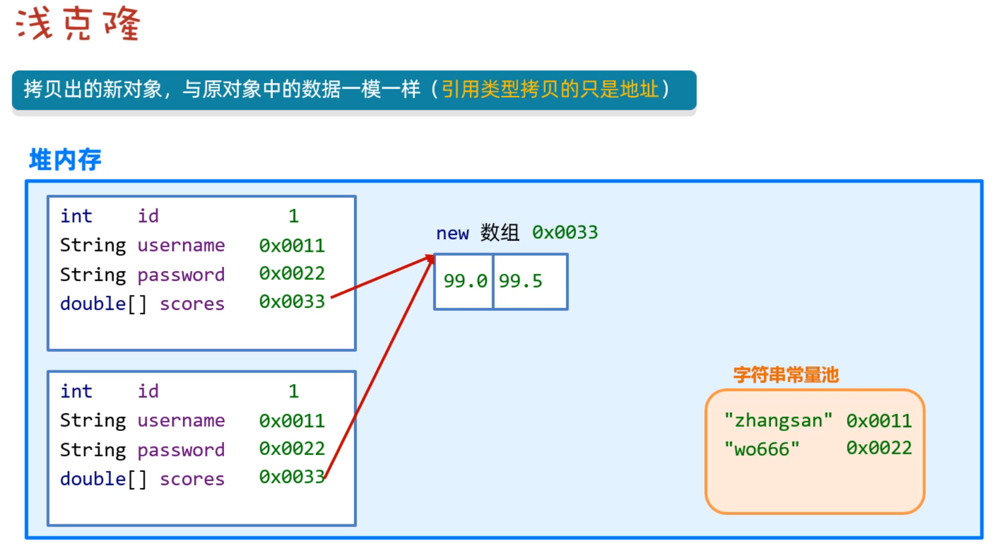

# 面向对象
## 面向对象和面向过程的区别是什么？（what)
> 面向过程是解决问题的过程拆分成一个个解决方法来执行，面向对象是抽象出对象，让对象去执行相关的方法来解决问题
- 面向对象和面向过程的性能哪个高？
  - 这个没有绝对之分，得看情况而定

### 什么是面向对象的三大特性？：
1. 封装：将数据（也就是属性或者说成员变量）和操作这些数据的方法封装在一个对象内部

2. 继承：继承允许一个类（子类）继承现有类（父类或者基类）的属性和方法。以提高代码的复用性，建立类之间的层次关系。
   同时，子类还可以重写或者扩展从父类继承来的属性和方法，从而实现多态。
3. 多态：同一方法在不同的对象上有不同的行为，通过方法重写（覆盖）/重载来实现（how）
4. #### 多态解决了什么问题？

多态的目的是为了提高代码的灵活性和可扩展性，允许在程序在运行时再确定调用的是子类还是父类的方法。

### 对象实体和对象引用的区别是什么（what)
1. 对象实体是实际存在于堆内存的对象，对象引用是指向实体对象的指针，或者说引用、别名，对象引用存在于栈内存中
2. 对象实体存在于堆内存中，对象引用存在于栈内存中
3. 一个对象引用只能指向一个对象实体，一个对象实体有多个对象引用 

#### 对象相等和引用相等的区别是什么（what)
- 对象相等是内存中的内容是否相等
- 引用相等是引用的地址是否相等

## 接口和抽象类的共同点和区别(what)
#### 共同

- 抽象类和接口都不能被实例化

#### 区别

> **设计目的**

- **接口**：用于定义一组没有实现的方法，规定实现这些接口的类必须实现这些方法。**接口更多地强调的是行为的规范**。一个类可以实现多个接口，从而组合多种行为。
- **抽象类**：用于定义一个类的基本结构，包括一些已实现的方法和一些未实现的抽象方法。抽象类作为其他类的基类，允许提供部分实现，并允许子类重写或实现特定方法。

> **方法的实现**

- **接口**：接口中的方法默认是抽象的，**不能有方法的实现**（Java 8开始接口可以有`default`方法和`static`方法，这些方法可以有实现，但仍然无法存储状态）。
- **抽象类**：抽象类可以包含**抽象方法**（没有方法体）和**非抽象方法**（有实现）。它可以在某些情况下提供部分实现，让子类继承和使用。（但是**“抽象类必须包含抽象方法”**这句话是错的!)

> **成员变量**

- **接口**：接口中只能有`public static final`类型的常量，不能包含其他类型的成员变量（也就是所有的字段都是常量，且**隐式**是`public static final`）。
- **抽象类**：抽象类可以包含普通的成员变量，并且这些变量可以有各种访问修饰符（`private`，`protected`，`public`等），抽象类允许存储实例状态。**（抽象方法的默认访问权限是** `default`（包私有），而不是 `public`）

> **构造方法**

- **接口**：接口**没有构造方法**，因为接口不能被实例化。
- **抽象类**：抽象类可以有构造方法，尽管抽象类本身不能被实例化，但它的子类可以调用其构造方法。

> **多重继承**

- **接口**：Java允许一个类实现多个接口，这相当于Java支持了一种有限的多重继承（通过行为的组合）。
- **抽象类**：一个类只能继承一个抽象类（单继承限制），因为Java不支持多继承。

> **访问修饰符**

- **接口**：接口中定义的所有方法默认是`public`，不能使用其他修饰符。
- **抽象类**：抽象类中可以定义带有各种访问修饰符（`private`, `protected`, `public`）的方法和变量。
## 拷贝
### 深拷贝和浅拷贝、引用拷贝是什么（what）(*)

> 深拷贝和齐纳拷贝都新建了一个对象，引用不会新建一个对象
>
> 首先浅拷贝和深拷贝都会新建一个对象，但是引用拷贝不会创建一个新的对象，只是创建了一个指向原始对象的引用
>
> 浅拷贝的新对象和原始对象内容相同，但是原始对象的子对象，浅拷贝只是复制了一份引用，而不是把子对象也复制一份
>
> 深拷贝就会递归的也复制子对象，复制得更彻底

- **浅拷贝会创建一个对象**，新对象的内容与原始对象相同，不过对于原始对象的子对象，浅拷贝只是复制了一份引用，而不是把子对象也复制了一份
- **深拷贝会创建一个对象**，并且递归复制原始对象的子对象
- **引用拷贝不会创建一个对象**只是创建了一个指向原始对象的新引用
- 
- 

