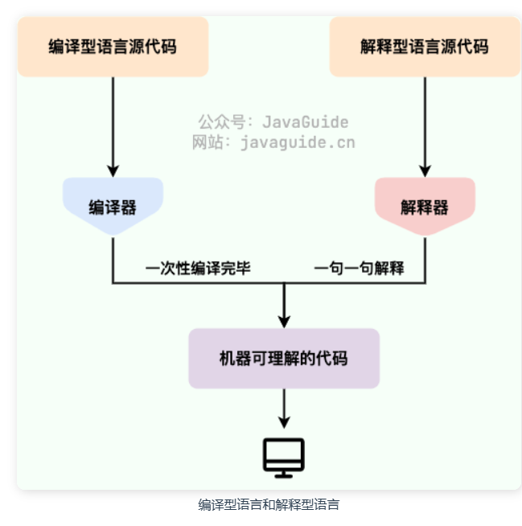

# 2.Java基础

## 编译过程

java编译和解释共存

## 变量


### Java的8种基本类型和对应的的包装类型，以及他们的默认值（what）
1. byte ：Byte 0：初始化强制赋值(以下同理)
2. short：Short 0:
3. int：Integer 0：
4. float：Float 0f：
5. double：Double 0d:
6. long：Long 0L
7. char：Character 'u0000'
8. boolean：Boolean false:初始化强制赋值（null）

### 为什么包装类型在main里要显式的初始化赋值？（why）
> 1.因为在main方法里他们是作为局部变量存在的，局部变量没有默认值，必须显式初始化
> 
> 2.作为类的字段时，他们是作为成员变量存在的，无论是基本数据类型还是包装类型，都有默认值
> 默认值都为空，int为0，boolean为false 包装类型的默认值为null
### 包装类型的缓存机制你了解吗？（what）
> (when)当对Byte、Short、Integer、Character等（除了float和double,8除去2，还剩6种)进行自动装箱的时候，会触发到一个缓存机制（所有包装类型都有吗）
> （what)这个缓存机制指的是当用户创建一个【-128到127这个范围的整型或短字符的时候，会返回一个已经存在的对象引用，而不是重新创建一个对象
> （why)这是因为Java在编译的时候会对整型和短字符进行缓存，范围是-128到127的数值
> Byte,Short,Integer,Long 这 4 种包装类默认创建了数值 [-128，127] 的相应类型的缓存数据，Character 创建了数值在 [0,127]
> 范围的缓存数据，Boolean 直接返回 True or False。
> But
> 而不适用于显示的装箱（使用构造函数或者valueOf方法）。
####  局部变量的成员变量的区别在哪（where）
1. 从语法格式来看：成员变量是属于类的，而局部变量是属于代码块或者方法的
    > 成员变量可以被public，private，以及static修饰，而局部变量不能被访问修饰符和static修饰
   > 但两者都可以被final修饰
2. 从生存周期来看:成员变量是属于对象的，随着对象的创建而存在，局部变量是属于则方法的，随着方法被调用而自动生成，随着方法结束而消亡
3. 从存储来看：成员变量如果是static修饰的，那么这个成员变量是属于类的，如果没用static修饰，那么这个成员变量是属于实例的；对象存在于堆内存中，局部变量存在于栈中
4. 从默认值来看：如果没有显示的赋值，成员变量有默认值（如果是包装类型，那么默认值是null，如果不是包装类似，就以对应的类型为准）局部变量没有自动默认值，必须显示赋值
    > 如果成员变量如果被final修饰，那么也必须显示赋值

`延伸：`
### 为什么成员变量要有自动默认值？（why）
1. 成员变量默认自动的赋初始值的话，可以避免空引用的错误
2. 并且，对象的状态会更有可预测性

###  显示赋值的方法（how？以Boolean为例）
1. **使用`Boolean`的静态工厂方法`valueOf`**：`Boolean`类提供了一个静态工厂方法`valueOf`，它接受一个`boolean`值或者一个`String`值（`"true"`或`"false"`）作为参数，并返回对应的`Boolean`对象。示例如下：

    ```java
    Boolean bool1 = Boolean.valueOf(true); // 传入布尔值 true
    Boolean bool2 = Boolean.valueOf("true"); // 传入字符串 "true"
    ```

2. **使用自动装箱**：Java提供了自动装箱（autoboxing）的功能，可以自动将基本数据类型转换为对应的包装类型。因此，你可以直接将`boolean`值赋给`Boolean`对象，系统会自动进行装箱操作。示例如下：

    ```java
    Boolean bool3 = true; // 自动装箱，将布尔值 true 赋给 Boolean 对象
    ```
> Boolean 在java9之后没有无参构造方法

### final是什么（what）
- 一个关键字
- 被final修饰的不能被修改，不能被重写
  - final修饰变量：变量不能被修改
  - final修饰方法：方法不能被修改
  - final修饰类；类不能被继承
### 访问修饰符是什么？(what)
> 访问修饰符有pubilc protected privete default（包级别） 

### 为什么Java更经常用包装类型而不是基本的数据类型？（why）
>1. 首先这样能更好的利用java语言面向对象的特性，使用包装类型能让基本的数据类型也能像对象一样被使用，例如调用方法，传递给方法
>2. 第二个，在空值方面，基本数据类型没有null，但包装类型有，这样可以很好的表示一个值可能缺失或者未知的情况（例如开发中大量的DTO)
>3. 第三个，泛型只能用于对象，在使用集合类的时候，需要包装类型，不能用基本的数据类型
>4. 第4个，在java的框架设计上面，java的很多标准库和框架通常使用包装类型，这种偏好也比较影响了我们的开发习惯
>5. 第5个，java提供的自动装箱和自动拆箱，使得基本类型在包装类型之间的转换更方便

### 静态变量是什么（what）
> 静态变量是被static修饰的变量，它属于类的，是类的属性，该类的所有对象共享，可以通过类名来访问
> static修饰的变量可以被修改

## 方法
### 方法的类型有哪些（what）
> 静态方法和实例方法（what)和区别，
> 1. 静态方法是属于类的，通过类名访问，静态方法不能调用非静态成员
> 2. 实例方法是属于对象的，必须通过对象调用
 
>静态方法只能用类名访问吗，不能用对象访问吗（why)
> 推荐用类名，以清晰地表达其与类的关系。：可以用对象，但这样做通常被视为不推荐的做法，
> 因为静态属性是与类相关联的而不是与类的特定实例相关联的。

> 为什么静态方法不能调用非静态成员（why)
> 1. 因为静态方法在类加载的时候就被分配内存了，在对象被创建之前就可以被调用，非静态成员是属于对象的。静态方法存在的时候非实例成员还不存在
> 


### 为什么java只有值传递？
- java设计者看到了c++的引用传递的弊端，所以他的设计初衷是为了简化这个吧？
### 什么是java值传递？（what）
> - 总结：如果传递的是基本数据类型，那就是传统意义上的值传递，如果是对象类型，起始传递的是对象的引用的拷贝，通过这个拷贝来修改原始对象是允许的
>   - Java 中没有传统意义上的引用传递，是因为 Java 的参数传递都是按值传递。即使是对象引用也是按值传递的，传递的是对象引用的拷贝（对象引用是对象的地址，对象引用的拷贝就是地址的拷贝，所以还是拿到了地址，还是会影响到原来的对象。），而不是对象本身
考虑下面的代码：
>   - c++中的引用传递，传递的是变量的原来的引用？不是再把引用拷贝过一次之后再传递的

通过一个简单的例子来说明 Java 中的值传递。
```java
public class Main {
    public static void main(String[] args) {
        int num = 10;
        System.out.println("Before method call: " + num);
        modifyValue(num);
        System.out.println("After method call: " + num);
    }

    public static void modifyValue(int num) {
        num = 20;
        System.out.println("Inside method: " + num);
    }
}
```

在这个例子中，我们有一个 `main` 方法，在其中创建了一个名为 `num` 的整数变量并初始化为 10。然后，我们调用了 `modifyValue` 方法，并将 `num` 作为参数传递给它。在 `modifyValue` 方法中，我们将参数 `num` 的值更改为 20，并打印出新的值。

但是，如果你运行这个程序，你会发现输出如下：

```
Before method call: 10
Inside method: 20
After method call: 10
```

这里的关键是，在调用 `modifyValue` 方法时，我们传递了 `num` 的值的拷贝。在方法内部，对参数 `num` 的修改只是修改了这个拷贝，而不会影响到 `main` 方法中原始的 `num` 变量。所以，尽管在方法内部将 `num` 更改为 20，但在 `main` 方法中输出 `num` 的值仍然是 10。

现在，让我们看一个涉及对象的例子：

```java
class Person {
    String name;

    public Person(String name) {
        this.name = name;
    }
}

public class Main {
    public static void main(String[] args) {
        Person person = new Person("Alice");
        System.out.println("Before method call: " + person.name);
        modifyReference(person);
        System.out.println("After method call: " + person.name);
    }

    public static void modifyReference(Person p) {
        p.name = "Bob";
        System.out.println("Inside method: " + p.name);
    }
}
```
输出：
```
Before method call: Alice
Inside method: Bob
After method call: Bob
```

> 这个例子和之前的例子类似，不同之处在于现在我们有一个 `Person` 类型的对象作为参数传递给 `modifyReference` 方法。在方法内部，我们修改了这个对象的属性 `name`。但是，由于我们传递的是对象的引用的拷贝，修改了对象的属性后，这个修改将影响到原始的对象。（修改引用本身不会影响原始引用，但是对引用指向的对象的修改会影响原始对象。）所以，即使在方法调用之后，我们在 `main` 方法中输出对象的属性时，它仍然是 "Bob"，而不是 "Alice"。

这就是 Java 中值传递的工作原理。

### 为什么java传递对象类型的方法参数时，是进行对象的引用的拷贝，也会影响到对象，为什么不直接传递原始对象的原来的引用呢(why）？

> Java 中传递对象类型的方法参数时，实际上是将对象的引用（reference）进行了拷贝，而不是对象本身。这意味着，虽然传递的是引用的拷贝，但这两个引用仍指向同一个对象实例，因此对这个对象的修改会影响到原始对象。

为什么不直接传递原始对象的原来的引用呢？这涉及到Java中参数传递的机制。Java中所有的传递都是按值传递，包括对象引用(是个地址值，不是对象）。也就是说，当你将一个对象作为参数传递给方法时，你传递的是对象引用的值（即对象在内存中的地址），而不是对象本身。


