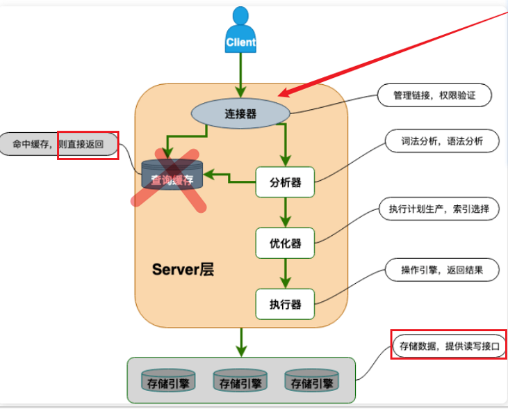

# 数据库事务
    
## mysql的基础架构（一条sql语句在mysql中的执行流程）
假设我们有一个简单的表结构如下：

```sql
CREATE TABLE students (
    id INT AUTO_INCREMENT PRIMARY KEY,
    name VARCHAR(50),
    age INT
);
```

现在我们要执行一个简单的查询语句，查找年龄小于 25 岁的学生：

```sql
SELECT * FROM students WHERE age < 25;
```

这个查询语句在 MySQL 中的执行流程可以描述如下：

1. **SQL 解析**：
    - MySQL 首先对 SELECT 语句进行解析，确定查询的语法和语义。

2. **权限验证**：
    - MySQL 检查当前用户是否具有对 `students` 表的查询权限。

3. **执行计划生成**：
    - MySQL 根据查询条件 `age < 25` 生成执行计划，可能选择使用 `age` 列上的索引进行扫描。

4. **查询优化器**：
    - 查询优化器可能会根据 `age` 列的统计信息和索引信息，决定使用索引扫描或者表扫描来获取数据。

5. **执行计划执行**：
    - MySQL 根据执行计划执行查询操作，可能会进行索引扫描或者表扫描，获取符合条件的数据行。

6. **结果返回**：
    - MySQL 将查询结果返回给客户端，包括符合条件的学生记录。

通过这个简单的例子，可以清楚地了解一个查询语句在 MySQL 中的执行流程。

### 总结：

在 MySQL 中，一个 SQL 语句的执行流程通常可以分为以下几个步骤：

1. **经过连接器权限验证**：
    - 在执行 SQL 语句之前，MySQL 会对当前用户的权限进行验证，确保当前用户对所操作的数据库和表具有足够的权限。如果用户权限不足，将会拒绝执行该 SQL 语句。

2. **分析器-SQL 解析**：
    - MySQL 首先对 SQL 语句进行解析，分析 SQL 语法，确定 SQL 语句的语义和操作类型。解析器会检查 SQL 语句的语法是否正确，并生成相应的内部数据结构，用于后续的执行计划生成和优化。

3. **执行器-执行计划生成**：
    - 接下来，MySQL 会根据 SQL 语句的操作类型（查询、插入、更新、删除等）生成执行计划。执行计划包括了 MySQL 如何获取和处理数据的详细步骤，比如选择使用哪个索引、是否进行表扫描等。

4. **优化器-查询优化器**：
    - MySQL 的查询优化器会对生成的执行计划进行优化，以提高 SQL 语句的执行效率。优化器会根据表的统计信息、索引信息等来选择最优的执行路径，以减少查询的成本和响应时间。

5. **执行器-操作引擎-执行计划执行**：
    - 最后，MySQL 根据生成的执行计划开始执行 SQL 语句。根据执行计划的指示，MySQL 可能会进行索引扫描、表扫描、排序、聚合等操作，最终得到 SQL 语句的结果集。

6. **结果返回**：
    - 当 SQL 语句执行完成后，MySQL 将结果返回给客户端。对于查询语句，返回的是查询结果集；对于更新语句，返回的是受影响的行数；对于插入语句，返回的是新插入数据的标识等。


这就是一个 SQL 语句在 MySQL 中的基本执行流程。在执行过程中，MySQL 会根据实际情况动态调整执行计划，并根据硬件资源和数据库状态来进行优化和调整，以提高 SQL 语句的执行效率。
## mysql有哪两个存储引擎？都有事务吗（what）
- mysql常用的存储引擎有InnoDB（默认）和myISAM(还有别的)
- MYISAM存储殷勤不支持行级锁、事务、MVCC机制，InnoDB支持


## 单个mysql事务
### 什么是事务（what）
- 事务是把一个或多个操作作为一个整体的操作，里面的事务要么全部成功，要么全部失败
### 事务特性ACID
- A:原子性
- C：一致性
- I：隔离性
- D：持久性
- AID是为了C
分别代表什么意思？
   > 举个例子：
  > A要向B转账100：
  > A的账户要减少100，B的账户要增加100
  > 1. 这两个操作要么都成功，要么都失败：原子性
  > 2. 一致性则是，事务在执行前后数据库应该保持一致性状态,A的账户减100，B的账户必须要增加一百，前后的总额没有变
  > 3. 隔离性：当前这个事务不能受其他事务的干扰
  > 4. 持久性：事务一旦提交，其结果应该是永久性的，即使系统崩溃或发生故障，数据也不应该丢失

### 为什么需要事务？（why)
- 保证数据的一致性和完整性
### 如何开启事务（how）
在 MySQL 中，你可以使用以下 SQL 命令来开启事务：

```sql
START TRANSACTION;
```

这个命令会开始一个新的事务，并将其标记为当前事务。一旦你开启了事务，你就可以执行一系列的 SQL 操作，这些操作将会被当作一个原子操作组合起来，要么全部执行成功，要么全部失败。

如果你想在 MySQL 中开启一个只读的事务，可以使用以下命令：

```sql
START TRANSACTION READ ONLY;
```

而如果你想开启一个读写的事务，则可以使用：

```sql
START TRANSACTION READ WRITE;
```

无论是哪种类型的事务，一旦你完成了所有的数据库操作，并且你想要提交事务，你可以使用以下命令：

```sql
COMMIT;
```

如果你想要取消事务并回滚到事务开始之前的状态，可以使用以下命令：

```sql
ROLLBACK;
```

以上就是在 MySQL 中开启、提交和取消事务的方法。
**例子**
假设我们有一个银行数据库，其中包含了账户信息，我们想要进行一系列的银行交易操作，确保这些操作要么全部成功，要么全部失败。我们可以使用事务来保证这一点。

首先，我们开启一个事务：

```sql
START TRANSACTION;
```

然后，我们执行一系列的 SQL 操作，比如从一个账户转账到另一个账户，并更新账户余额：

```sql
UPDATE accounts SET balance = balance - 100 WHERE account_id = 123;
UPDATE accounts SET balance = balance + 100 WHERE account_id = 456;
```

接着，我们检查一下余额是否足够，以确保转账不会导致负余额：

```sql
SELECT balance FROM accounts WHERE account_id = 123;
SELECT balance FROM accounts WHERE account_id = 456;
```

如果余额足够，我们提交事务：

```sql
COMMIT;
```

如果出现任何问题，比如余额不足，我们可以取消事务并回滚到操作之前的状态：

```sql
ROLLBACK;
```

通过使用事务，我们可以确保所有的银行交易操作要么全部成功，要么全部失败，从而保证了数据的一致性和完整性。
## 并发事务带来什么问题（why-but）

- 脏读
- 不可重复读
- 幻读

## 为什么要有事务的隔离级别？（why）
### 事务有哪些隔离级别（what？）
- 读未提交（Read-Uncommited）
- 读已提交（read-commited）
- 可重复读（repeatabl-read）【默认】
- 可串行化
### 事务的隔离界别是怎么实现的(how)
- 锁+MVCC
 > 锁和多版本并发控制（MVCC）是实现 MySQL 中隔离级别的两种关键机制。它们提供了不同的方法来处理并发访问数据库时可能出现的问题，并在不同的隔离级别下提供了不同的行为。下面分别介绍它们是如何实现隔离级别的：

1. **锁**：

    - **行级锁和表级锁**：MySQL 支持行级锁和表级锁。**行级锁允许多个事务同时访问同一表的不同行**，从而提高了并发性。
      - 表级锁在整个表上进行锁定，会导致其他事务无法访问整个表，因此并发性较低。
        
    - **共享锁和排他锁**：共享锁（Shared Lock）允许多个事务同时读取同一资源，但阻止其他事务对资源进行写入操作。
      - 排他锁（Exclusive Lock）则只允许一个事务对资源进行读写操作，阻止其他事务读取或写入资源。

    - **锁的粒度**：MySQL 中的锁可以精确到行级别，也可以是更高级别的表级锁。
      - 行级锁可以提高并发性，但可能会导致锁定开销增加。表级锁相对粗粒度，可以降低锁定开销，但并发性较差。

2. **多版本并发控制（MVCC）**：

    - （what）MVCC 是一种更为先进的并发控制机制，它通过保存数据的多个版本来实现不同事务之间的隔离性。

    - （how）当事务开始时，MySQL 会为每个修改的行创建一个版本，并将其保存在 undo log 中。
    - 其他事务在读取数据时会根据事务的可见性规则，选择合适的数据版本进行读取，从而实现隔离性。

    - 在 MVCC 中，读取操作不会阻塞写入操作，也不会阻塞其他读取操作，因此可以提高并发性。同时，MVCC 也能够解决不可重复读和幻读等并发问题。

    - MySQL 使用 MVCC 来实现可重复读隔离级别。在可重复读隔离级别下，事务在执行期间看到的数据保持一致，
    - 即使其他事务对数据进行了修改。这是通过使用快照读和间隙锁来实现的。

### 快照读和间隙锁是什么（what）
### InnoDB有哪几类行级锁（what）？
    好的，让我们包含一个具体的账户表格，并演示两个事务对账户进行转账操作的情景。

假设我们有以下账户表格：

| id  | account_number | balance |
|-----|----------------|---------|
| 1   | A              | 1000.00 |
| 2   | B              | 500.00  |

现在，我们有两个事务，分别要对账户A进行转账操作：

事务1：
```sql
START TRANSACTION;
UPDATE accounts SET balance = balance - 100 WHERE account_number = 'A';
```

事务2：
```sql
START TRANSACTION;
UPDATE accounts SET balance = balance - 50 WHERE account_number = 'A';
```

> 在这个例子中，事务1尝试向账户A转账100美元，而事务2尝试向账户A转账50美元。由于两个事务都涉及同一账户，因此需要对该账户的行进行加锁。

> 在事务1执行更新操作时，会对账户A的记录加上排他锁（Exclusive Lock），阻止其他事务对其进行读取或写入操作。这样，当事务2也尝试更新账户A的记录时，由于无法获取到排他锁，将会被阻塞，直到事务1完成或回滚后才能继续执行。

通过行级锁的机制，我们确保了对同一账户的转账操作是串行执行的，从而避免了并发问题，保证了数据的一致性和完整性。
1. **共享锁（Shared Lock）**：
    - 共享锁也称为读锁，它允许多个事务同时读取同一行数据，但阻止其他事务对该行进行写入操作。
    - 共享锁之间互不阻塞，多个事务可以同时持有共享锁。
    - 当事务持有共享锁时，其他事务也可以获取共享锁，但无法获取排他锁。

2. **排他锁（Exclusive Lock）**：
    - 排他锁也称为写锁，它阻止其他事务对同一行数据进行读取或写入操作。
    - 排他锁和其他任何锁都是互斥的，一个事务持有排他锁时，其他事务无法获取任何类型的锁。
    - 当事务持有排他锁时，其他事务无法获取共享锁或排他锁。

3. **意向锁（Intention Lock）**：
    - 意向锁是为了提高并发性能而引入的一种辅助锁机制，用于**表级锁定**。
    - 在事务获取行级锁之前，会先获取相应的意向锁，用于表示事务打算对表中的行进行何种类型的锁定。
    - 意向锁有两种类型：意向共享锁（IS）和意向排他锁（IX），分别表示事务打算获取共享锁或排他锁。

4. **记录锁（Record Lock）**：
    - 记录锁是 InnoDB 存储引擎在行级锁定时使用的一种锁定机制，用于锁定**单个行**。
    - 当事务获取到记录锁后，其他事务无法对该行进行**相同类型**的锁定，但可以对该行进行**不同类型**的锁定。
    - 记录锁在事务提交或回滚后会自动释放。

5. **间隙锁（Gap Lock）**：
    - 间隙锁用于锁定两个**索引记录**之间的“间隙”，防止其他事务在这个间隙中插入新的记录。
    - 间隙锁可以避免幻读的问题，在某些情况下也可以避免不可重复读问题。
    - InnoDB 存储引擎在可重复读隔离级别下会自动使用间隙锁。

好的，让我来为你举一个例子来说明意向锁、间隙锁和记录锁的作用。

假设我们有一个简单的学生信息数据库表格，包含学生的ID、姓名和年龄：

| 学生ID | 姓名   | 年龄 |
|--------|--------|------|
| 1      | 小明   | 20   |
| 2      | 小红   | 22   |
| 3      | 小华   | 21   |
| 4      | 小李   | 23   |

现在有两个并发事务正在执行：

1. **事务A**：要向数据库中插入一个年龄为21岁的学生记录。
2. **事务B**：要查询年龄在20岁到22岁之间的学生记录。

下面是事务A和事务B执行时各种锁的作用：

| 事务   | 操作                     | 锁类型      | 锁定行/间隙 | 说明                                                             |
|--------|--------------------------|-------------|-------------|------------------------------------------------------------------|
| 事务A | 开始                     |             |             |                                                                  |
| 事务A | 意向排他锁（Intent X）   | 意向排他锁  |             | 表示事务A打算在表上设置排他锁                                   |
| 事务A | 间隙锁（Gap Lock）       | 间隙锁      | 学生ID为3   | 防止其他事务在年龄为21的记录前后插入新的记录                   |
| 事务A | 记录锁（Record Lock）    | 记录锁      | 学生ID为3   | 防止其他事务同时修改ID为3的学生记录                             |
| 事务A | 插入年龄为21的学生记录   | 排他锁      | 新记录      | 事务A向表中插入了一个年龄为21的学生记录，并持有排他锁           |
| 事务A | 提交                     |             |             |                                                                  |
| 事务B | 开始                     |             |             |                                                                  |
| 事务B | 意向共享锁（Intent S）   | 意向共享锁  |             | 表示事务B打算在表上设置共享锁                                   |
| 事务B | 间隙锁（Gap Lock）       | 间隙锁      | 学生ID为1   | 防止其他事务在年龄为20到22之间的记录前后插入新的记录           |
| 事务B | 查询年龄在20岁到22岁之间的学生记录 | 共享锁 | 学生ID为1到学生ID为3之间 | 事务B查询了年龄在20岁到22岁之间的学生记录，并持有共享锁 |
| 事务B | 提交                     |             |             |                                                                  |

在这个例子中，事务A使用了意向锁、间隙锁和记录锁来确保插入新记录的原子性和一致性，而事务B使用了意向锁和间隙锁来确保查询结果的一致性。通过合理使用这些锁，可以保证并发事务的安全执行，避免数据不一致的情况发生。想·
## 如何控制并发事务？（how）
- 锁+mvcc
- 


