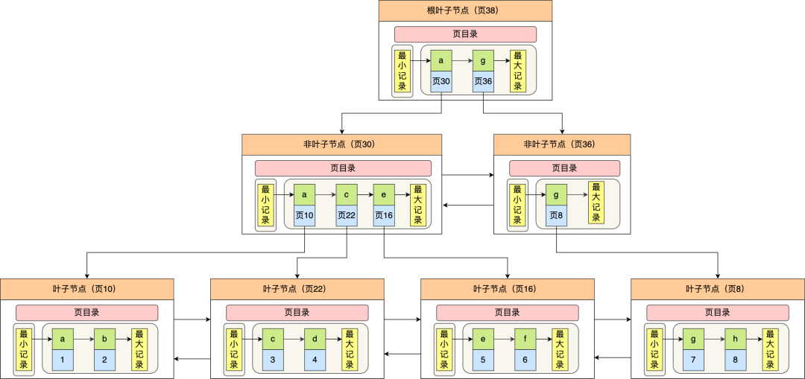
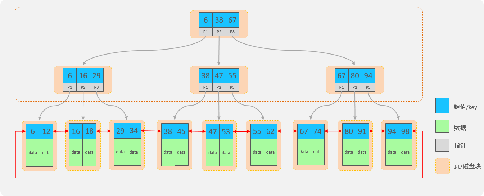
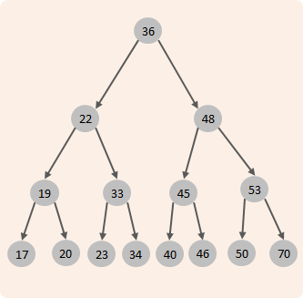
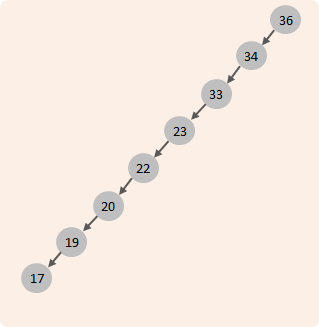
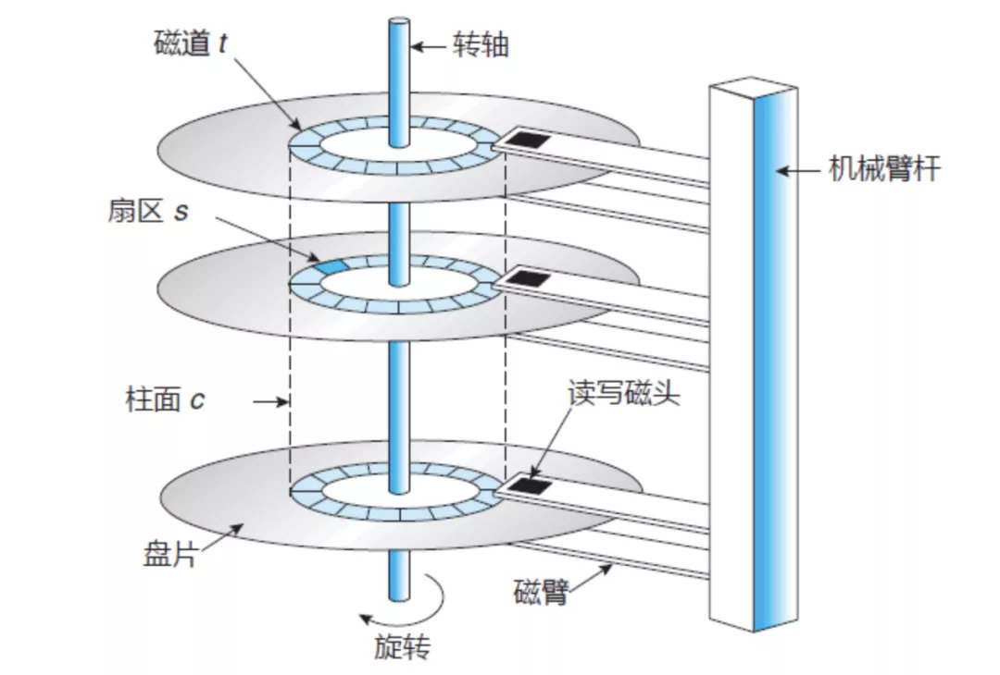

# mysql索引
## mysql索引的分类
::: tip
分为**聚簇索引和非聚簇索引两大类**
聚簇索引的叶子节点存放的是实际数据，所有完整的用户记录都存放在聚簇索引的叶子节点

二级索引(非聚簇索引）的叶子节点存放的是主键值，而不是实际数据，
如果要查询的列走了二级索引，而叶子节点存放的值没有恰好全部包含自己要查询的数据列，那么就会进行**回表查询**
如果恰好包含，那么就是**覆盖索引**

**聚簇索引必须有且只有一个**，也就是主键索引，二级索引可以有多个
:::

**主键索引：**

**二级索引：**



### 索引的优缺点

> 优点：
>
> 1. 提高数据查询的效率，降低数据库的IO成本。(因为索引是个有序的结构)
> 2. 通过索引列对数据进行排序，降低数据排序的成本，降低CPU消耗。
>
> 缺点：
>
> 1. 索引会占用存储空间。
>
> 2. 索引大大提高了查询效率，同时却也降低了insert、update、delete的效率，
     >
     >    **因为如果更新的某个列创建了索引，那么相应的索引列也得更新。**

> 测试没有使用索引的查询：
>

>
> 添加索引后查询：
>
> ```mysql

>


## mysql索引底层结构
> 


在没有了解B+Tree结构前，回顾下之前所学习的树结构：

> 二叉查找树：左边的子节点比父节点小，右边的子节点比父节点大
>
> 为什么要这样设计呢：
>
> - 因为这样可以提高查询，插入删除的效率，如果要找的target大，那么就可以去节点的左子树查找，反之就去它的右边查找，避免一个盲目遍历的过程



> 当我们向二叉查找树保存数据时，是按照从大到小(或从小到大)的顺序保存的，此时就会形成一个单向链表，搜索性能会打折扣。



> 可以选择平衡二叉树或者是红黑树来解决上述问题。（红黑树也是一棵平衡的二叉树）


> 但是在Mysql数据库中并没有使用二叉搜索数或二叉平衡数或红黑树来作为索引的结构。

### 为什么不采用二叉搜索树或者是红黑树来作为索引的结构？（*）

>  因为不管是二叉搜索数还是红黑数，一个节点下面只能有两个子节点。会导致在数据量大的情况下，树的层级比较深，会影响检索速度。树的高度一旦高了，磁盘IO的次数就会增多，检索速度就会降低。

<details>
    <summary>答案</summary>
    因为不管是二叉搜索数还是红黑数，一个节点下面只能有两个子节点。会导致在数据量大的情况下，树的层级比较深，会影响检索速度。此时在数据量大的情况下，就会造成数的高度比较高，树的高度一旦高了，检索速度就会降低。
</details>


> 磁盘IO的时间：
> 寻找扇区的旋转时间+寻道时间+数据传输时间
> 